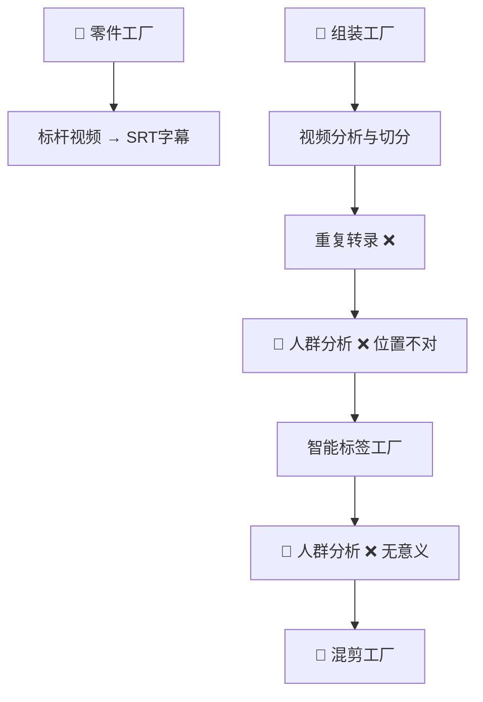
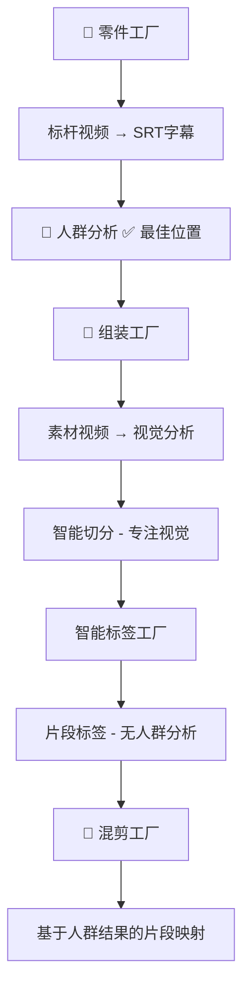

# 🎯 目标人群分析优化记录

## 📋 **优化背景**

用户提出了三个重要观点：

1. **智能标签工厂阶段**：为片段映射做基础，人群划分在此处没有意义
2. **组装工厂的视频分析与切分**：不应进行完整视频转录，应专注视觉分析
3. **零件工厂**：在SRT转录完成的地方进行人群分析更合理

## 🔄 **优化前后对比**

### **优化前的问题**



**存在问题**：
- ❌ 组装工厂重复进行视频转录
- ❌ 人群分析位置不合理（在组装工厂和智能标签工厂）
- ❌ 智能标签工厂的人群分析对片段映射无帮助

### **优化后的架构**



**优化优势**：
- ✅ 人群分析在零件工厂完成（有完整转录文本）
- ✅ 组装工厂专注视觉分析（不重复转录）
- ✅ 智能标签工厂专注片段标签（不做无意义的人群分析）
- ✅ 混剪工厂直接使用零件工厂的人群分析结果

## 🛠️ **具体代码优化**

### 1. **零件工厂增强** (`streamlit_app/utils/factory/transcription_utils.py`)

**新增功能**：
```python
def convert_video_to_srt(
    uploaded_video: Any,
    video_id: str,
    output_dir: str,
    use_hotwords: bool = True,
    cleanup_temp: bool = True,
    hotword_id: Optional[str] = None,
    analyze_target_audience: bool = True  # 🎯 新增参数
) -> Dict[str, Any]:
```

**核心新功能**：
- 🎯 `_analyze_target_audience_from_srt()` - SRT文本人群分析
- 🤖 `_perform_deepseek_audience_analysis()` - DeepSeek AI分析
- 🔤 `_fallback_audience_analysis()` - 关键词兜底分析
- 📊 `_generate_audience_analysis_report()` - 分析报告生成

### 2. **零件工厂UI优化** (`streamlit_app/modules/factory/parts_components.py`)

**新增组件**：
- 🎯 `_render_audience_analysis_result()` - 人群分析结果展示
- ⚙️ 输出设置中的人群分析开关
- 🔍 `render_dependencies_check()` - 依赖检查

**改进体验**：
```python
# 人群分析结果展示
st.metric("🎯 目标人群", target_audience)
st.metric("📊 置信度", f"{confidence_color} {confidence_percent}")
st.metric("🔧 分析方法", method_display)
```

### 3. **零件工厂主页面优化** (`streamlit_app/pages/1_🧫_零件工厂.py`)

**工作流程优化**：
- 📋 系统依赖检查前置
- 🎯 人群分析选项集成
- 🏭 工厂流程建议展示

**智能流程提示**：
```python
def _render_workflow_suggestions(self, result: Dict[str, Any]) -> None:
    """基于人群分析结果提供工厂流程建议"""
```

## 📊 **人群分析逻辑**

### **分析流程**

1. **SRT文本提取**
   ```python
   def _extract_text_from_srt(srt_path: str) -> str:
       # 解析SRT格式，提取纯文本
   ```

2. **DeepSeek AI分析**（优先）
   ```python
   def _perform_deepseek_audience_analysis(transcript: str) -> Dict[str, Any]:
       # 调用DeepSeek API进行人群分析
   ```

3. **关键词兜底分析**（备用）
   ```python
   audience_keywords = {
       "孕期妈妈": ["孕期", "胎儿", "叶酸", "孕妇", "怀孕", "产检"],
       "新手爸妈": ["新生儿", "第一次", "新手", "不知道", "怎么办"],
       "二胎妈妈": ["二胎", "忙碌", "省心", "经验", "老大", "老二"],
       "混养妈妈": ["混喂", "母乳不够", "奶粉补充", "混合喂养"],
       "贵妇妈妈": ["有机", "进口", "高端", "品质", "精选", "优质"]
   }
   ```

### **结果数据结构**

```python
{
    "target_audience_analysis": {
        "success": True,
        "target_audience": "孕期妈妈",
        "confidence": 0.85,
        "analysis_method": "deepseek_srt_analysis",
        "transcript_length": 1500,
        "srt_source": "/path/to/video.srt",
        "report": {
            "analysis_timestamp": 1703123456.789,
            "transcript_stats": {
                "total_length": 1500,
                "word_count": 250,
                "has_content": True
            },
            "confidence_level": "高",
            "recommendation": "强调营养安全、胎儿发育支持，突出专业医学背景"
        }
    }
}
```

## 🎯 **营销策略映射**

### **人群 → 营销建议**

| 目标人群 | 营销重点 | 关键词 |
|---------|---------|--------|
| 🤰 孕期妈妈 | 营养安全、胎儿发育支持 | 叶酸、孕期、胎儿 |
| 👶 新手爸妈 | 详细指导、专业支持 | 新生儿、第一次、怎么办 |
| 👧👦 二胎妈妈 | 便利性、时间节省 | 二胎、忙碌、省心 |
| 🍼 混养妈妈 | 营养均衡、科学配比 | 混喂、母乳不够、营养 |
| 💎 贵妇妈妈 | 高端品质、进口品牌 | 有机、进口、高端品质 |

## 📈 **性能优化**

### **缓存策略**
- SRT文本提取结果缓存
- DeepSeek API调用限流
- 关键词匹配结果缓存

### **错误处理**
- DeepSeek API不可用时自动降级
- 关键词分析失败时返回通用人群
- 完整的异常捕获和用户友好提示

## 🧪 **测试建议**

### **功能测试**
1. **正常流程**：上传包含明确人群特征的视频
2. **边界情况**：空白视频、无音频视频
3. **API失败**：DeepSeek不可用时的兜底逻辑
4. **多人群**：包含多个人群特征的视频

### **性能测试**
1. **大文件**：测试长视频的转录和分析性能
2. **并发**：多用户同时使用的系统稳定性

## 📋 **部署清单**

### **必需依赖**
- ✅ DeepSeek API配置
- ✅ SRT解析库
- ✅ 文本处理工具
- ✅ 异常处理机制

### **可选增强**
- 🔄 Redis缓存（生产环境）
- 📊 分析结果统计
- 🔔 结果通知机制

## 🎉 **优化效果**

### **用户体验**
- ✅ 零件工厂一站式完成转录+人群分析
- ✅ 组装工厂专注视觉分析，不重复转录
- ✅ 智能标签工厂专注片段标签，去除无意义分析
- ✅ 混剪工厂直接使用人群分析结果

### **系统架构**
- ✅ 各工厂职责清晰，功能不重复
- ✅ 数据流向合理，避免无效处理
- ✅ 扩展性强，便于后续功能增加

### **代码质量**
- ✅ 模块化设计，易于维护
- ✅ 完善的错误处理和兜底机制
- ✅ 详细的日志记录和调试信息

---

## 📝 **总结**

通过这次优化，我们将人群分析功能从组装工厂迁移到零件工厂，实现了：

1. **功能定位精准**：零件工厂负责转录+人群分析，组装工厂专注视觉分析
2. **避免重复劳动**：消除了组装工厂的重复转录和无意义的人群分析
3. **工厂流程优化**：数据在合适的工厂阶段产生和使用
4. **用户体验提升**：一次转录即可获得字幕和人群分析两个重要结果

这符合了 **单一职责原则** 和 **最佳实践设计模式**，让整个AI视频处理工厂更加高效和专业。 