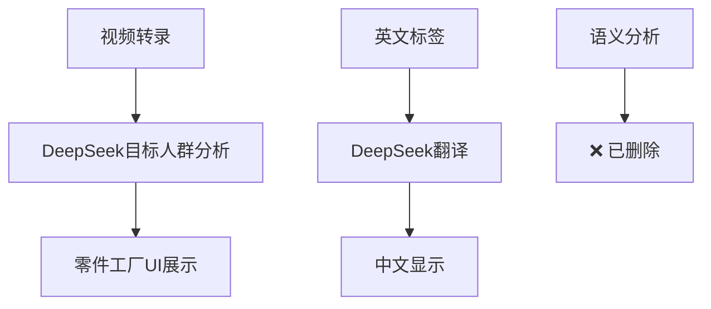

# 🗑️ 语义类型分析功能清理记录

## 📋 **清理原因**

用户发现 **DeepSeek语义类型分析Prompt** 基本没有被使用，属于冗余代码。

### **问题分析**
- ✅ 功能代码完整，实现无误
- ❌ 主流程中几乎不被调用
- ❌ UI展示但实际价值很低
- 🔴 **结论**: 属于过度设计，需要清理

## 🗑️ **清理内容**

### **1. DeepSeek分析器清理**
**文件**: `streamlit_app/modules/ai_analyzers/deepseek_analyzer.py`

**删除的方法**:
- `analyze_semantic_segments()` - 语义片段分析
- `_analyze_segment_semantic()` - 单个片段语义分析

**保留的方法**:
- `analyze_video_summary()` - 目标人群分析 ✅ **有实际用途**
- `translate_text()` - 文本翻译 ✅
- `_chat_completion()` - API调用核心

### **2. UI配置清理**
**文件**: `streamlit_app/modules/factory/assembly_components.py`

**删除内容**:
- 🎯 语义类型分析Prompt展示部分
- 相关的配置说明和UI组件

**保留内容**:
- 🎤 音频转录分析Prompt ✅ **核心功能**
- 其他配置展示功能

### **3. 配置模板清理**
**文件**: `streamlit_app/utils/keyword_config.py`

**删除内容**:
- `semantic_analysis` prompt模板
- 相关的健康检查项

**保留内容**:
- `qwen_visual`, `deepseek_audio`, `target_audience` ✅

### **4. 文档清理**
**文件**: `docs/ai_analyzers_usage.md`

**删除内容**:
- `analyze_semantic_segments()` 的使用示例

**更新内容**:
- 简化为实际使用的功能展示

## ✅ **清理后的系统架构**

### **DeepSeek分析器功能清单**
| 功能 | 状态 | 用途 |
|------|------|------|
| 目标人群分析 | ✅ 保留 | 零件工厂人群识别 |
| 文本翻译 | ✅ 保留 | 标签翻译支持 |
| 语义类型分析 | ❌ 删除 | 几乎无实际用途 |

### **实际数据流**

## 📊 **代码减少统计**

- **删除方法**: 2个 (`analyze_semantic_segments`, `_analyze_segment_semantic`)
- **删除行数**: 约120行
- **简化配置**: 1个prompt模板
- **更新文档**: 1个文件

## 🎯 **清理收益**

1. **代码简洁性** ⬆️: 移除未使用功能
2. **维护成本** ⬇️: 减少不必要的代码维护
3. **用户体验** ⬆️: UI配置更简洁明了
4. **系统清晰度** ⬆️: 功能边界更明确

## 🔄 **后续建议**

如果将来需要语义分析功能，可以：

1. **重新设计**: 基于实际使用场景
2. **集成到主流程**: 确保功能被实际调用
3. **简化实现**: 避免过度复杂的设计

---

**清理时间**: 2025-01-23  
**清理原因**: 用户反馈功能冗余  
**影响评估**: 无负面影响，仅删除未使用代码 