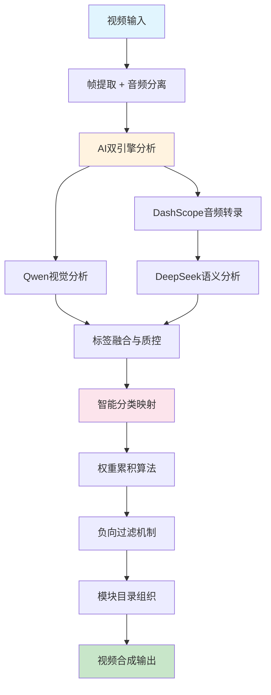
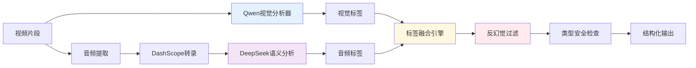
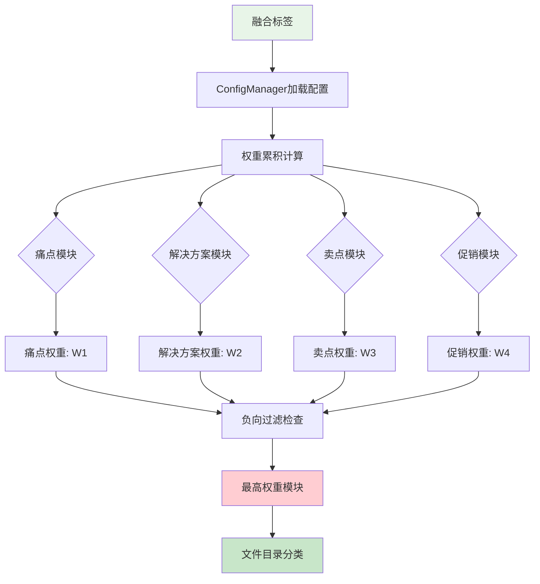

# 🏭 母婴视频智能工厂 - 技术分析报告

## 📋 项目概述

### 🎯 项目目的
**将母婴KOL的长视频自动分析并智能分类为"痛点/解决方案/卖点/促销"四个营销模块，然后重新组合生成精准的营销混剪视频。**

核心价值：通过AI技术实现母婴内容的自动化营销素材生产，提升内容运营效率和精准度。

---

## 🏗️ 核心架构

### 四工厂模块化设计
```
🏭 母婴视频智能工厂
├── 🧫 零件工厂 (Parts Factory)
│   └── 视频转录与字幕生成 (DashScope API)
├── 🧱 组装工厂 (Assembly Factory)  
│   └── 多模型AI分析与切分 (Qwen + DeepSeek + Google Cloud)
├── 🐛 调试工厂 (Debug Factory)
│   └── AI行为调优与业务词表管理
└── 🧪 混剪工厂 (Mixing Factory)
    └── 智能视频分类与合成 (权重算法 + FFmpeg)
```

### 技术架构层次
```
┌─────────────────────────────────────────────────────────┐
│                    Streamlit Web UI                    │
├─────────────────────────────────────────────────────────┤
│  🧫零件工厂  │  🧱组装工厂  │  🐛调试工厂  │  🧪混剪工厂  │
├─────────────────────────────────────────────────────────┤
│              AI分析引擎 (多模型协同)                      │
│  Qwen2.5视觉  │  DeepSeek音频  │  Google Cloud Video   │
├─────────────────────────────────────────────────────────┤
│                 配置管理中心                             │
│         keywords.yml (统一业务词表)                     │
├─────────────────────────────────────────────────────────┤
│              核心处理引擎                               │
│  视频分割器  │  分类映射器  │  合成引擎  │  反幻觉机制    │
├─────────────────────────────────────────────────────────┤
│                 基础设施层                              │
│    FFmpeg    │   OpenCV    │   Python   │   Docker     │
└─────────────────────────────────────────────────────────┘
```

---

## 🛠️ 技术栈

### 前端框架
- **Streamlit**: Web应用框架，提供交互式UI界面
- **多页面架构**: 模块化页面设计，支持工厂间独立操作

### AI模型集成
- **Qwen2.5-VL**: 阿里千问视觉模型，负责视频帧分析
- **DeepSeek**: 音频转录与语义理解
- **Google Cloud Video Intelligence**: 视频内容分析
- **DashScope**: 阿里云语音转录服务

### 核心技术
- **Python 3.10+**: 主要开发语言
- **FFmpeg**: 视频处理与合成
- **OpenCV**: 计算机视觉处理
- **Sentence Transformers**: 语义相似度计算

### 配置管理
- **YAML**: 业务词表配置 (`keywords.yml`)
- **JSON**: 分析结果存储
- **环境变量**: 敏感信息管理

---

## 📊 系统流程图

### 主处理流程


### AI分析引擎架构


### 分类决策流程


---

## 🚨 现阶段问题分析

### 1. 系统稳定性问题 (P0 - 紧急)

#### API服务不稳定
```bash
DashScope任务未成功完成，状态: FAILED
🎤 转录失败: DashScope任务状态: FAILED
```
**影响**: 音频分析链路完全断裂，导致分析质量严重下降
**根因**: DashScope API配额/网络/认证问题

#### 类型安全崩溃
```bash
调试分类执行失败: 'NoneType' object has no attribute 'lower'
```
**影响**: 分类引擎频繁崩溃，无法正常处理视频
**根因**: `mapper.py`中缺乏None值检查，AI返回空值时系统崩溃

#### 配置文件依赖错误
```bash
无法加载全局设置: No such file or directory: 'matching_rules.json'
```
**影响**: 系统无法正常启动配置加载
**根因**: 配置迁移不完整，代码仍引用已删除文件

### 2. 分类算法缺陷 (P0 - 紧急)

#### 分类分布严重失衡
**现象**: 所有视频片段都被归类到"促销"目录
**根因分析**:
- 促销模块配置了过于宽泛的正向情绪词("开心","快乐","健康")
- 权重设置过高(3-4)，其他模块无法竞争
- 母婴内容天然包含大量正向情绪，导致系统性偏向

#### 权重算法不平衡
```yaml
# 当前配置问题
促销模块:
  - 开心: 权重4  # 过于宽泛
  - 快乐: 权重3  # 过于宽泛
  - 健康: 权重4  # 过于宽泛

其他模块:
  - 特定词汇权重普遍偏低(1-2)
```

### 3. AI分析质量问题 (P1 - 重要)

#### 品牌识别成功率低
**现象**: 重点品牌(启赋、illuma)经常漏识别
**根因**:
- Prompt中品牌强调不足
- 缺乏专门的品牌识别重试机制
- 反幻觉机制过于激进，误杀真实产品场景

#### 多模型协同效果差
**现象**: 
```bash
🎤 视觉分析存在未识别内容，启用DeepSeek音频转录兜底分析...
```
**根因**: 
- Qwen视觉分析覆盖率不足
- DeepSeek音频分析频繁失败
- 缺乏有效的结果融合策略

### 4. 工程质量问题 (P1 - 重要)

#### 路径解析不一致
```bash
📁 检查路径: data/input/test_videos (存在: True)
📁 检查路径: ../data/input/test_videos (存在: True)
```
**影响**: 跨平台兼容性差，部署环境敏感

#### 缓存管理混乱
```bash
🎯 缓存清除完成！共清除 279 项
```
**影响**: 频繁的缓存清理影响性能，缓存策略不合理

---

## 🔧 技术债务清单

### 立即修复 (P0)
1. **类型安全加固**: 所有字符串操作前添加None检查
2. **API容错机制**: DashScope失败时的完整降级策略  
3. **配置文件清理**: 完全移除matching_rules.json依赖
4. **权重重平衡**: 调整促销模块权重，避免单一模块垄断

### 架构优化 (P1)
1. **分类算法改进**: 引入阈值机制和多轮决策
2. **品牌识别强化**: 多重Prompt强调+专用重试机制
3. **路径管理统一**: 建立统一的路径解析机制
4. **多模型融合优化**: 改进AI结果合并策略

### 长期重构 (P2)
1. **配置中心化**: 统一配置管理，消除多源配置冲突
2. **质量监控体系**: 分析结果质量评估与自动调优
3. **模块解耦**: 减少工厂间的紧耦合依赖
4. **性能优化**: 缓存策略优化和并发处理能力提升

---

## 💡 优化建议

### 短期解决方案 (1-2周)
1. **紧急修复**: 修复NoneType错误，确保系统基本可用
2. **权重调优**: 重新平衡四个模块的权重配置
3. **API监控**: 添加DashScope API状态监控和自动重试

### 中期改进 (1-2月)
1. **算法升级**: 实现多轮分类决策机制
2. **品牌识别**: 专门优化品牌识别准确率
3. **质量保障**: 建立分析结果质量评估体系

### 长期规划 (3-6月)
1. **架构重构**: 实现真正的微服务化架构
2. **智能化升级**: 引入自适应学习机制
3. **平台化发展**: 支持多行业视频分析需求

---

## 📈 项目价值与前景

### 核心价值
- **效率提升**: 自动化处理替代人工剪辑，效率提升10-50倍
- **精准营销**: AI驱动的内容分类，提升营销转化率
- **规模化运营**: 支持批量处理，满足大规模内容生产需求

### 技术创新点
- **多模型协同**: 视觉+音频双引擎分析
- **业务词表驱动**: 可配置的AI行为调优
- **智能反幻觉**: 品牌感知的内容过滤机制

### 发展潜力
该项目具备从母婴垂直领域扩展到其他行业的技术基础，核心AI分析引擎和分类算法具有较强的通用性和可扩展性。

---

*报告生成时间: 2025-06-12*  
*技术栈版本: Python 3.10+ | Streamlit | Qwen2.5 | DeepSeek* 